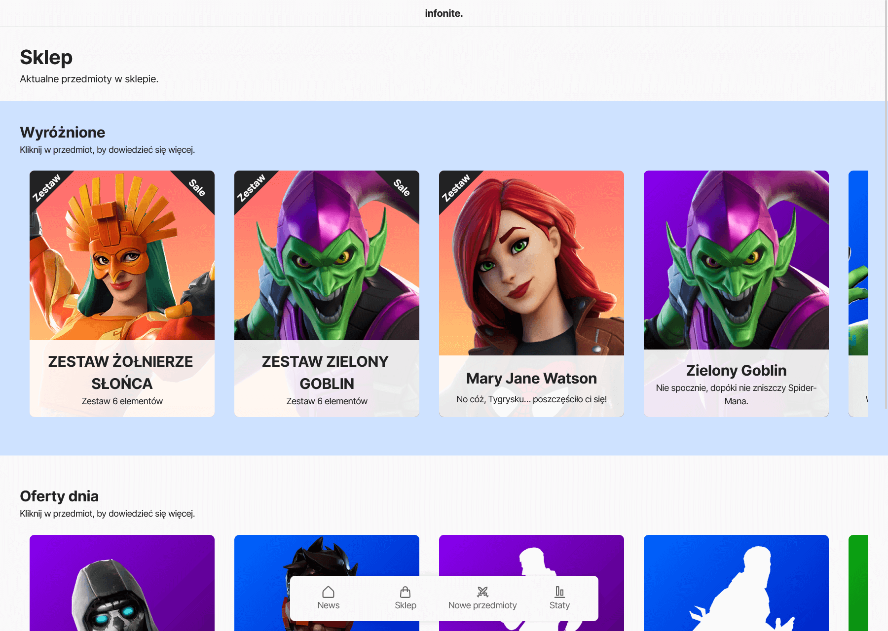

<br/>
<p align="center">
  <a href="https://github.com/sebastianhaber/infonite">
    
  </a>

  <h3 align="center">Infonite</h3>

  <p align="center">
    Sprawdzaj newsy, sklep, przedmioty i statystyki prosto z Fortnite!
    <br/>
    <br/>
    <a href="https://sebastianhaber.github.io/infonite">Demo</a>
  </p>
</p>

  





## Stworzone za pomocą

* [React JS](https://reactjs.org/)
* [Fortnite API](https://fortnite-api.com/)


### Instalacja

1. Uzyskaj klucz API na [https://fortnite-api.com/](https://fortnite-api.com/)

2. Sklonuj repo

```sh
git clone https://github.com/sebastianhaber/infonite.git
```

3. Zainstaluj paczki NPM

```sh
npm install
```

4. Wprowadź klucz API w `.env`

```JS
REACT_APP_FORTNITE_API_TOKEN=ENTER_YOUR_API_TOKEN
```

### Tworzenie Pull Request

1. Fork
2. Stwórz swój Branch (`git checkout -b feature/AmazingFeature`)
3. Zrób commit (`git commit -m 'Add some AmazingFeature'`)
4. Zapisz na Branchu (`git push origin feature/AmazingFeature`)
5. Stwórz Pull Request

## Licencja

Distributed under the MIT License. See [LICENSE](https://github.com/sebastianhaber/infonite/blob/main/LICENSE.md) for more information.

## Autor

* **[Sebastian Haber](https://github.com/sebastianhaber/)** - *Frontend Developer*

## Podziękowania dla

* [Fortnite API](https://fortnite-api.com/)
* [Vlad Gorshkov](https://unsplash.com/@nuclearvee)
